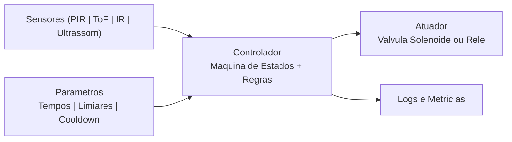

```mermaid
flowchart LR
    S["Sensores (PIR | ToF | IR | Ultrassom)"]
    C["Controlador<br/>Maquina de Estados + Regras"]
    A["Atuador<br/>Valvula Solenoide ou Rele"]
    L["Logs e Metric as"]
    P["Parametros<br/>Tempos | Limiares | Cooldown"]

    S --> C
    P --> C
    C --> A
    C --> L
```
